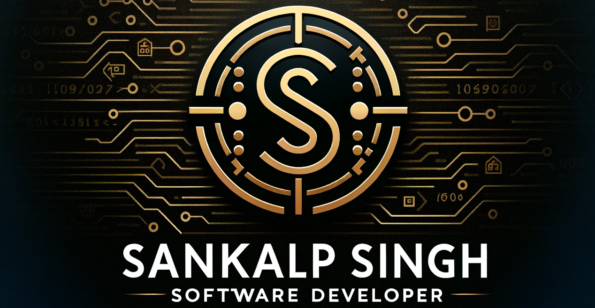

<h1 align="center">Hi 👋, I'm Sankalp Singh</h1>
<h3 align="center">A Data Analyst from Dallas, Texas 📊</h3>

Hello! I'm a data enthusiast with 4+ years of experience turning raw data into actionable insights. I specialize in SQL, Python, Tableau, and Power BI to help businesses make data-driven decisions.

 

---

### 🧠 Core Skills

  

---

### 🔧 Tools & Technologies

#### 📊 Data & Analysis

  
  
  

#### 💽 Databases

  
  

#### ☁️ Cloud & Big Data

  
  
  

#### 🛠️ ETL & Others

  
  

---

### 📈 GitHub Stats

  
   
  

---

### 📊 Projects

- **Customer Churn Prediction**  
  Used logistic regression and Python to predict churn and designed Tableau dashboards for business users.

- **Sales Performance Analysis**  
  Built SQL and Power BI dashboards to track KPIs and automate sales reporting workflows.

---

### 🤝 Connect With Me

  
  
  

---

  <em>"Turning numbers into narratives that drive action."</em>

Created by <a href="http://sankalpsinghrajput.com">Sankalp Singh</a>

